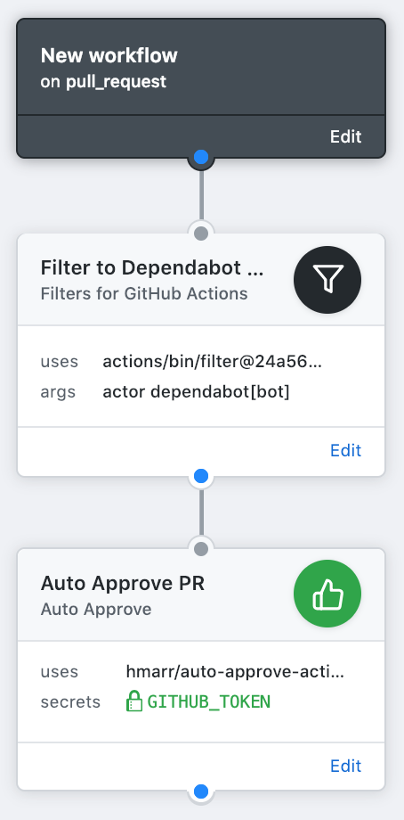

# GitHub Actions

Various GitHub Actions. To use, set the "uses" field to
`hmarr/actions/<name>@master`.

## auto-approve

**Requires the `GITHUB_TOKEN` environment variable checkbox to be checked.**

Automatically approve GitHub pull requests. Combine with the filter action to
only auto-approve certain users. For example, to auto-approve
[Dependabot][dependabot] pull requests, use `actor dependabot[bot]` as the args
for the filter action.

[dependabot]: https://github.com/marketplace/dependabot

## debug

Prints the environment variables and the event payload. Useful for debugging
GitHub Actions.
